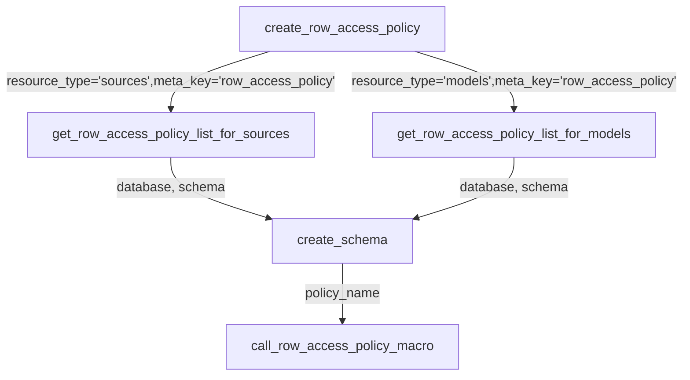
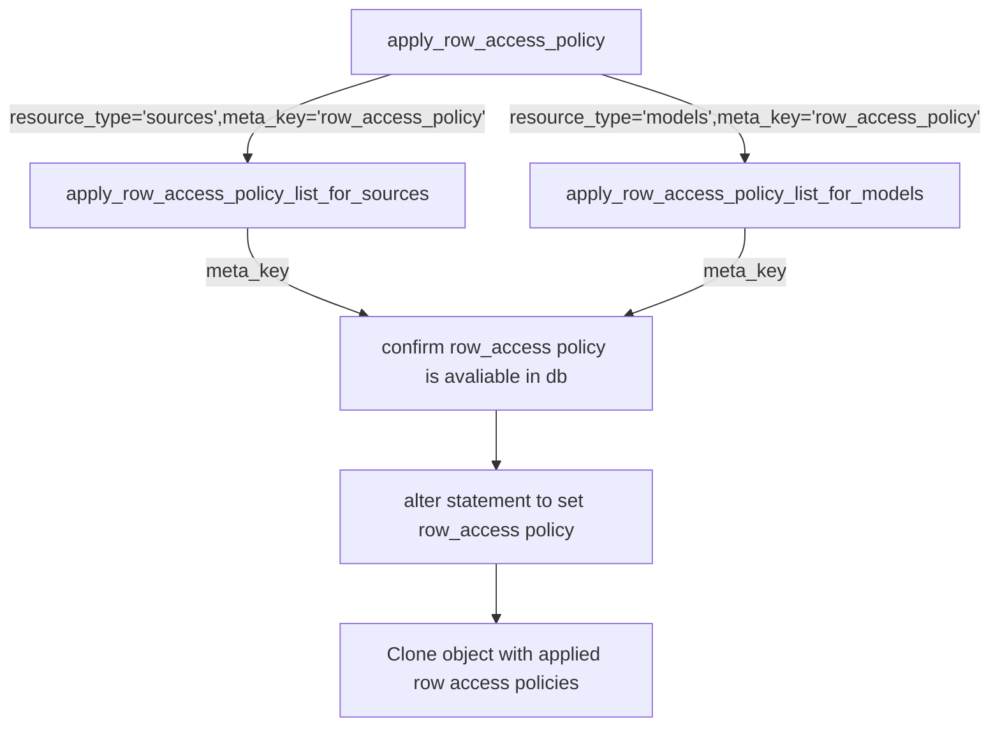

# dbt_snowflake_policies
- [Overview](#overview)
- [Installation Instructions](#installation-instructions)
- [How to configure database and schema for the row_access policy ?](#how-to-configure-database-and-schema-for-the-row_access-policy-)
- [How to apply row_access policy ?](#how-to-apply-row_access-policy-)
- [How to remove row_access policy ?](#how-to-remove-row_access-policy-)
- [How to validate row_access policy ?](#how-to-validate-row_access-policy-)
- [Process flow](#process-flow)
  - [Create row_access policy](#create-row_access-policy)
  - [Apply row_access policy](#apply-row_access-policy)
- [Known Errors and Solutions](#known-errors-and-solutions)
- [Credits](#credits)
- [References](#references)
- [Contributions](#contributions)
- [How to do an integration test ?](#how-to-do-an-integration-test-)

# Overview
This dbt package contains macros that can be (re)used across dbt projects with snowflake. `dbt_snowflake_policies` will help to apply [Dynamic Data Masking and Row Access Policies](https://docs.snowflake.com/en/user-guide/security-column-ddm-use.html) using [dbt meta](https://docs.getdbt.com/reference/resource-properties/meta).

# Installation Instructions

- Import the macros(macros/snow-rap) into your dbt project.


- This package uses [dbt_utils](https://hub.getdbt.com/dbt-labs/dbt_utils/latest/) package. When using `dbt_snowflake_policies` in your project, please install [dbt_utils](https://hub.getdbt.com/dbt-labs/dbt_utils/latest/) as well. 

  ```bash
     - package: dbt-labs/dbt_utils
       version: 0.8.2
  ```

> ✅ Please refer to the release version in dbt hub for the latest revision


# How to configure database and schema for the row access policy ?

By default this process creates the row access policies in same directory as the database objects. There are 2 methods for changing the default behavior by using the following parameters in your `dbt_project.yml` 

**Method 1 : Use a common database**

To change the database that your row access polices are created in set the following parameters:
* `use_common_row_access_policy_db` (optional): Flag to enable the usage of a common db/schema for all row_access policies. Valid values are “True” OR "False"
* `common_row_access_policy_db` (optional): The database name for creating row_access policies
* `common_row_access_policy_schema` (optional): The schema name for creating row_access policies
* `create_row_access_policy_schema` (optional): Valid values are “True” OR "False". The default value is “True”. When set to "False", helps to avoid creating schema if the dbt role does not have access to create schema

**Example** : var block in dbt_project.yml to enable using a common row_access policy database
```yaml
vars:
  use_common_row_access_policy_db: "True"
  common_row_access_policy_db: "DEMO_DB"
  common_row_access_policy_schema: "COMPLIANCE"
```

**Method 2 : Use a common schema (in the current database)**

To change only the schema (so that a common row_access policy schema is used in the same database as your model) set the following parameters:
* `use_common_row_access_policy_schema_only` (optional): Flag to enable the usage of a common schema in the current database for all row_access policies. Valid values are “True” OR "False"
* `common_row_access_policy_schema` (optional): The schema name for creating row_access policies
* `create_row_access_policy_schema` (optional): Valid values are “True” OR "False". The default value is “True”. When set to "False", helps to avoid creating schema if the dbt role does not have access to create schema
  
**Example** : var block in dbt_project.yml to enable using a common row_access policy schema (in the current database)

```yaml
vars:
  use_common_row_access_policy_schema_only: "True"
  common_row_access_policy_schema: "COMPLIANCE"
```

> ✅ If both `use_common_row_access_policy_db` and `use_common_row_access_policy_schema_only` are set to True, then `use_common_row_access_policy_db` will supercede `use_common_row_access_policy_schema_only`.

**Allow Custom Materializations**

To enable dbt_snowflake_policies to apply row_access policies to models generated from custom materializations in dbt, configure the following parameter:
* `custom_materializations_map` (optional): A dictionary containing key-value pairs mapping custom materializations in dbt to the objects they generate in Snowflake. For each pair, the key must be the name of the custom_materialization and the value must be either `table` or `view`. 

**Example** : var block in dbt_project.yml to enable application of row_access policies to a model generated using a custom materialiazition that ends up as a table in Snowflake.

```yaml
vars:
  custom_materializations_map: '{ "custom_incremental": "table" }'
```

# How to apply row_access policy ?

- row_access is controlled by [meta](https://docs.getdbt.com/reference/resource-properties/meta) in [dbt resource properties](https://docs.getdbt.com/reference/declaring-properties) for sources and models. 

- Decide your row_access policy name and add the key `row_access_policy` in the column which has to be masked.
  
  **Example** : source.yml

  ```yaml
  sources:
    - name: raw_sakila
      tables:
        - name: customer
          columns:
            - name: first_name
              meta:
                  row_access_policy: mp_encrypt_pii
  ```
  
  **Example** : model.yml

  ```yaml
  models:
    - name: stg_customer
      columns:
        - name: email
          meta:
            row_access_policy: mp_encrypt_pii
  ```

- Decide you force applying row_access policy to avoid unsetting them before re-applying again - it helps to remove handy stuff whenever the row_access policy definition is relocated to another database/schema:
  **Example** : var block in dbt_project.yml to enable using force

```yaml
vars:
  use_force_applying_row_access_policy: "True"
```

- Create a new `.sql` file with the name `create_row_access_policy_<row_access-policy-name-from-meta>.sql` and the sql for row_access policy definition. Its important for macro to follow this naming standard.
  
  **Example** : create_row_access_policy_mp_encrypt_pii.sql

  ```sql
  

  CREATE row_access POLICY IF NOT EXISTS {{node_database}}.{{node_schema}}.mp_encrypt_pii AS (val string) 
    RETURNS string ->
        CASE WHEN CURRENT_ROLE() IN ('ANALYST') THEN val 
             WHEN CURRENT_ROLE() IN ('DEVELOPER') THEN SHA2(val)
        ELSE '**********'
        END

  
  ```

> Its good to keep the row_access policy ddl organized in a directory say `\macros\snow-mask-ddl`

- Create the row_access policies by running below command  
  
| Resource Type | Command                                                                         |
| ------------- | ------------------------------------------------------------------------------- |
| sources       | `dbt run-operation create_row_access_policy --args '{"resource_type": "sources"}'` |
| models        | `dbt run-operation create_row_access_policy --args '{"resource_type": "models"}'`  |

- Alternatively, you can also create the row_access policies by specifying `pre-hook` OR `on-run-start` in your `dbt_project.yml`
  
  ```yaml
  on-run-start:
    - "{{ create_row_access_policy('models')}}"
    - "{{ create_row_access_policy('sources')}}"
  ```

- Apply the row_access policy by running below commands  

| Resource Type | Command                                                                        |
| ------------- | ------------------------------------------------------------------------------ |
| sources       | `dbt run-operation apply_row_access_policy --args '{"resource_type": "sources"}'` |
| models        | `dbt run -- model <model-name>`                                                |
| snapshots     | `dbt snapshot --select <snapshot-name> --target <target-name>`                 |

- Alternatively, you can also apply the row_access policies by specifying below `post-hook` to `dbt_project.yml`
  
  **Example** : dbt_project.yml

(For models)
  ```yaml
  models:
    post-hook: 
      - "{{ apply_row_access_policy('models') }}"
  ```
  
  (For snapshots)  
  ```yaml
  snapshots:
    post-hook: 
      - "{{ apply_row_access_policy('snapshots') }}"
  ```

- If you prefer to add this directly to a dbt model, see below command for a correct example
  
  ```yaml
  {{ config(post_hook = "{{ apply_row_access_policy('models') }}") }}
  ```

- Note:   ```"{{ apply_row_access_policy('sources') }}"``` can be added to ```on-run-end```, but 
```"{{ apply_row_access_policy('models') }}"``` and 
  ```"{{ apply_row_access_policy('snapshots') }}"``` should either be included specifically as post-hooks to 
  the models or snapshots sections of dbt_project.yml or added as a custom config to an individual model.

# How to remove row_access policy ?

- Remove the row_access policy applied by this package by running below commands  

| Resource Type | Command                                                                             |
| ------------- | ----------------------------------------------------------------------------------- |
| sources       | `dbt run-operation unapply_row_access_policy --args '{"resource_type": "sources"}'`    |
| models        | `dbt run-operation unapply_row_access_policy --args '{"resource_type": "models"}'`     |
| snapshots     | `dbt run-operation unapply_row_access_policy --args '{"resource_type": "snapshots "}'` |

- Alternatively, you can also apply the unmasking policies by specifying below `post-hook` OR `on-run-end` to `dbt_project.yml`
  
  **Example** : dbt_project.yml

(For models)
  ```yaml
  models:
    post-hook: 
      - "{{ unapply_row_access_policy('models') }}"
  ```
(For snapshots)
```yaml
  snapshots:
    post-hook: 
      - "{{ unapply_row_access_policy('snapshots') }}"
  ```

# How to validate row_access policy ?

```sql
-- Show row_access policy
SHOW ROW ACCESS POLICIES;
```

# Process flow
## Create row_access policy



## Apply row_access policy



# Known Errors and Solutions
| Error                                                               | Solution                                                                 |
| ------------------------------------------------------------------- | ------------------------------------------------------------------------ |
| dict object' has no attribute 'create_row_access_policy_mp_encrypt_pi' | Typo in yaml for row_access_policy, mp_encrypt_pi instead of mp_encrypt_pii |

# Credits
This package was created using examples from [Serge](https://www.linkedin.com/in/serge-gekker-912b9928/) and [Matt](https://www.linkedin.com/in/matt-winkler-4024263a/). Please see the [contributors](https://github.com/entechlog/dbt-snow-mask/graphs/contributors) for full list of users who have contributed to this project.

# References
- https://docs.snowflake.com/en/user-guide/security-column-ddm-intro.html
- https://getdbt.slack.com/archives/CJN7XRF1B/p1609177817234800
- https://docs.snowflake.com/en/sql-reference/functions/policy_references.html
- https://docs.snowflake.com/en/user-guide/security-column-ddm-use.html

# Contributions
Contributions to this package are welcomed. Please create issues for bugs or feature requests for enhancement ideas or PRs for any enhancement contributions.

# How to do an integration test ?
- This is applicable only to contributors
- cd into `dbt-snow-mask/integration_tests`
- Run `dbt deps`
- Run `dbt seed`
- Adjust the vars in `integration_tests\dbt_project.yml` and run `dbt run` 
